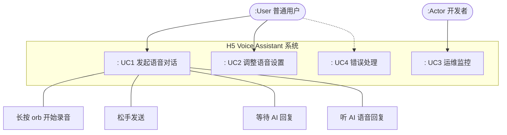
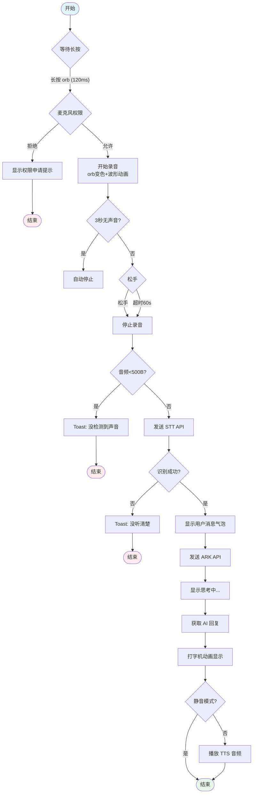
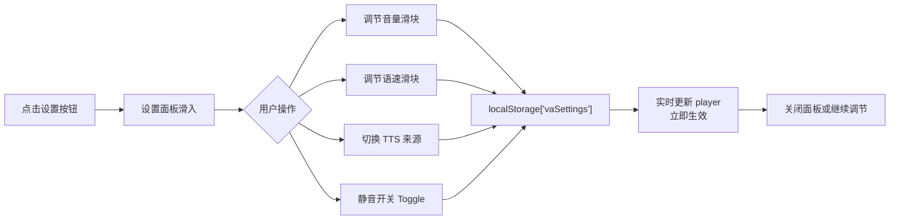
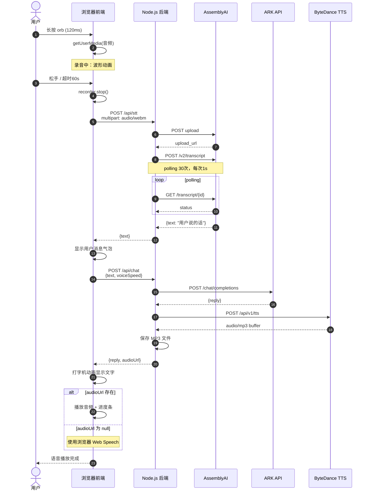

# 🎙️ H5 语音助手 — 需求规格说明书（SRS）

> 版本：v1.1 | 日期：2026-05-14 | 状态：已更新（Mermaid 图表）

---

## 一、项目概述

### 1.1 项目背景

H5 语音助手是一款**移动端优先**的语音交互 Web 应用。用户长按圆形按钮说话，松手后 AI 自动理解并以语音+文字同步回复。核心目标是提供极低门槛的语音交互体验，无需打字，开口即用。

### 1.2 项目范围

| 范围 | 说明 |
|------|------|
| **目标平台** | 移动端浏览器（H5）、微信内嵌浏览器 |
| **部署方式** | Node.js 后端 + 纯前端静态资源，Nginx 反向代理 |
| **核心能力** | 语音录制 → 语音识别 → 大模型对话 → 语音合成 → 回复播放 |
| **适用场景** | 老年人/手部不便用户、无键盘输入场景、快速问答 |

### 1.3 成功标准

- 移动端 Safari / Chrome / 微信浏览器可完整运行
- 端到端延迟（录音结束 → 首次文字出现）< 3s（网络正常时）
- 语音识别准确率满足日常对话需求
- 无需安装 App，通过 URL 即可访问

---

## 二、用户故事与功能列表

### 2.1 用户故事

| 角色 | 故事 | 优先级 |
|------|------|--------|
| 普通用户 | 我想长按说话，不用打字就能获得 AI 回答 | P0 |
| 普通用户 | 我希望 AI 回答能自动朗读，不用看屏幕 | P0 |
| 普通用户 | 我想调节 AI 说话的音量和速度 | P1 |
| 普通用户 | 我在嘈杂环境中能清楚知道是否在录音 | P1 |
| 开发者 | 我希望 API 接口有调用频率限制，防止滥用 | P1 |
| 开发者 | 关键配置（API Key）不能在前端暴露 | P0 |
| 开发者 | 后端服务要有健康检查接口，方便监控 | P2 |

### 2.2 功能清单

**P0 — 核心功能**

- [F1] 语音录制 — 长按 orb 开始，松开自动停止
- [F2] 语音识别 — 优先浏览器 Web Speech API，备用水星 STT API
- [F3] LLM 对话 — 调用水星 ARK API 获取回复
- [F4] 语音合成 — 优先服务器 TTS（水星），备选浏览器 Web Speech
- [F5] 文字+语音同步 — AI 回复先打字，后自动播放音频
- [F6] 敏感信息保护 — API Key 不在前端代码中硬编码

**P1 — 交互体验**

- [F7] 录音状态视觉反馈 — orb 放大+变色+波形动画
- [F8] 音量/语速设置 — 滑块调节，localStorage 持久化
- [F9] 静音模式 — 一键静音，顶部图标切换
- [F10] 错误提示 — Toast 提示用户权限拒绝/网络错误/无声音
- [F11] 麦克风权限引导 — 首次拒绝后显示开启权限说明

**P2 — 后端运维**

- [F12] 请求频率限制 — 每 IP 每分钟最多 30 次调用
- [F13] 健康检查接口 — GET /api/health，返回各服务可用状态
- [F14] 音频文件自动清理 — 启动时删除 1 小时前的临时文件
- [F15] API 请求超时保护 — 防止外部服务卡死导致后端挂起

---

## 三、用例图（Use Case Diagram）

---

## 四、业务流程（Activity Diagram）

### 4.1 核心语音对话流程

### 4.2 设置调节流程

---

## 五、序列图（Sequence Diagram）

### 5.1 完整语音对话时序

---

## 六、质量需求

### 6.1 性能指标

| 指标 | 目标值 | 说明 |
|------|--------|------|
| 页面首次加载 | < 2s | 静态资源 gzip 后 < 100KB |
| STT 延迟 | < 5s | AssemblyAI 标准转录 |
| ARK 响应 | < 3s | 包含网络延迟 + 模型推理 |
| TTS 生成 | < 2s | 短文本语音合成 |
| 打字机动画 | 每字 28ms | 约 35 字/秒 |

### 6.2 兼容性

| 平台 | 最低版本 |
|------|---------|
| Chrome | 66+ |
| Safari iOS | 14.5+ |
| Safari macOS | 14.1+ |
| 微信内置浏览器 | 基于 Chromium |

### 6.3 安全需求

- 全站 HTTPS（生产环境必须，微信要求）
- API Key 存储在后端 `.env`，前端完全不接触
- CORS 生产环境配置明确 origin
- 请求频率限制：30 req/min/IP
- 音频上传大小限制：10MB
