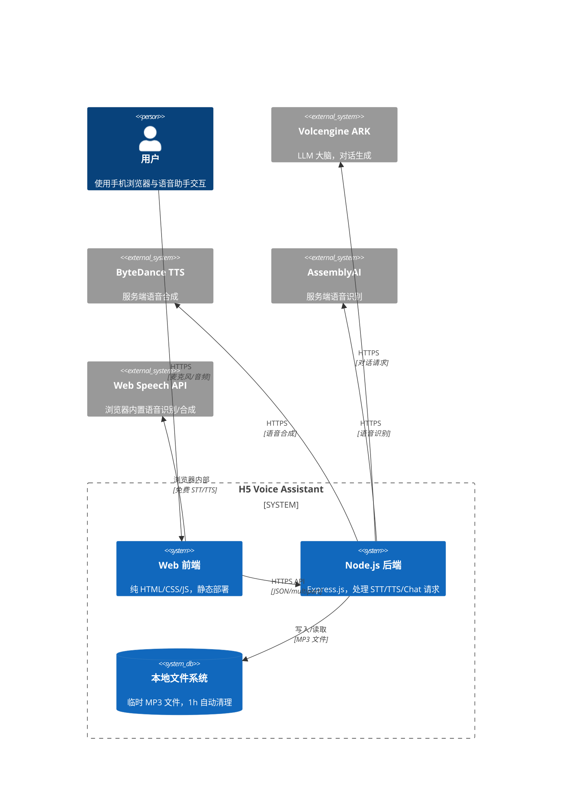
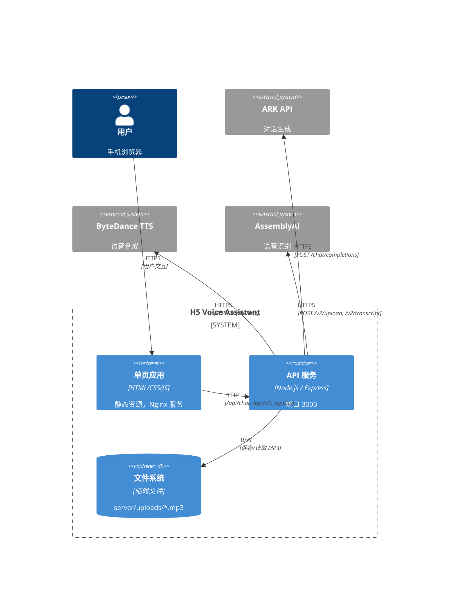
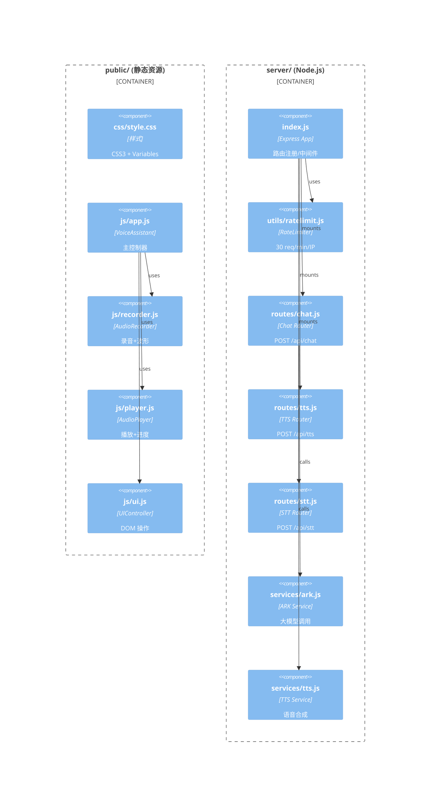
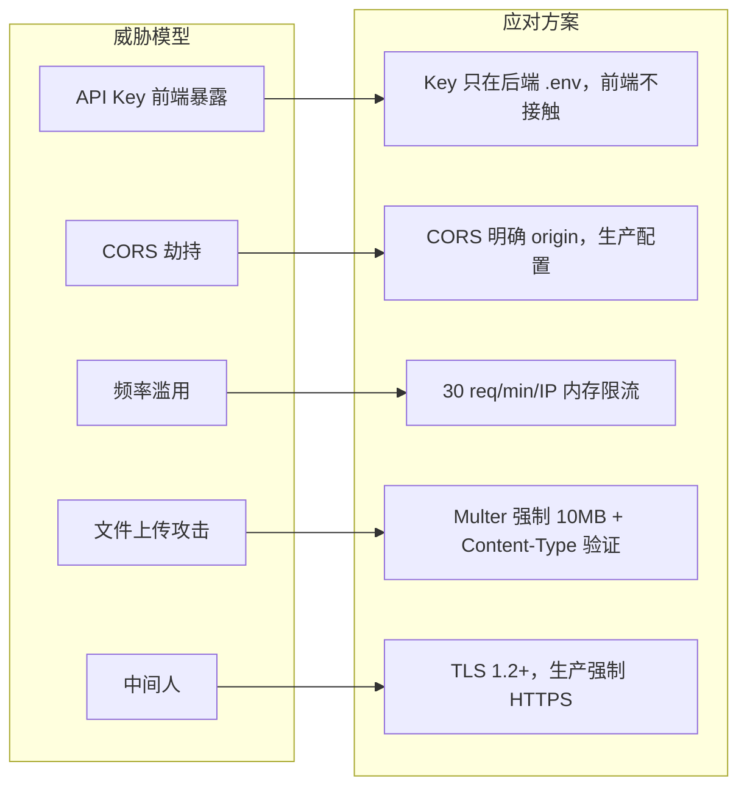
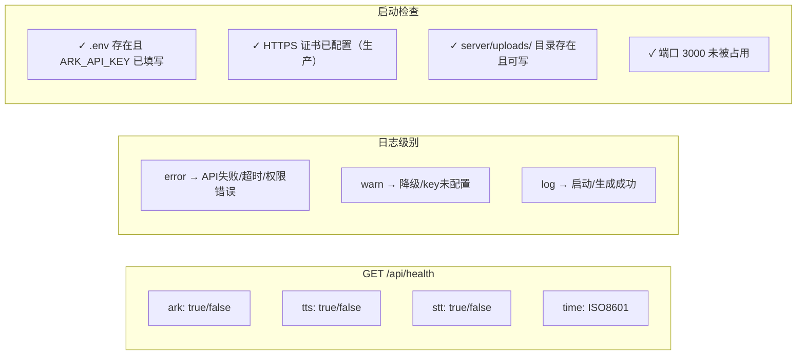

# 🎙️ H5 语音助手 — 技术选型与架构设计

> 版本：v1.1 | 日期：2026-05-14 | Mermaid 图表

---

## 一、技术栈概览

| 层级 | 技术 | 选型理由 |
|------|------|---------|
| 前端框架 | 原生 HTML/CSS/JS | 无需构建工具，体积小，加载快 |
| 样式 | CSS Variables + 原生 CSS | 主题色统一，无依赖 |
| 录音 | MediaRecorder API | 浏览器原生，无需 SDK |
| 语音识别 | Web Speech API → AssemblyAI | 优先浏览器免费，失败后服务端兜底 |
| 语音合成 | 水星 TTS → Web Speech API | 优先高质量服务端合成 |
| 可视化 | Canvas API | 波形绘制，无依赖 |
| 后端框架 | Express.js | 轻量，生态丰富 |
| 运行时 | Node.js 18+ | 原生 ES Module 支持 |
| HTTP 客户端 | node-fetch v3 | 兼容浏览器 fetch API |
| 音频上传 | Multer | 接收浏览器上传，不写磁盘直接转 |
| LLM | Volcengine ARK | 大模型对话 |
| TTS | ByteDance | 语音合成 |
| STT | AssemblyAI | 语音识别（服务端兜底）|

---

## 二、系统架构图（C4 模型）

### 2.1 Context（上下文视图）



### 2.2 Container（容器视图）



---

## 三、部署架构图（Deployment Diagram）

```mermaid
deploymentDiagram
    actor user as 用户(手机)
    node nginx["Nginx\n(TLS 终止 / 反向代理)"]
    node nodejs["Node.js\nExpress\n端口 3000"]
    node fs["文件系统\nserver/uploads/"]
    cloud ark["Volcengine ARK API"]
    cloud tts["ByteDance TTS API"]
    cloud stt["AssemblyAI API"]
    cloud browser["Web Speech API\n(浏览器内置)"]

    user -->|"HTTPS :443"| nginx
    nginx -->|"HTTP :3000"| nodejs
    nodejs --> ark
    nodejs --> tts
    nodejs --> stt
    nodejs --> fs
    user -->|"浏览器内部"| browser
```

---

## 四、工程结构（C4 Component 视图）



---

## 五、项目工程结构

```
h5-voice-assistant/
├── docs/                          # 设计文档 (Mermaid)
│   ├── 01_需求规格说明书.md
│   ├── 02_技术选型与架构设计.md     ← 本文档
│   ├── 03_概要设计.md
│   ├── 04_详细设计.md
│   └── 05_接口设计.md
│
├── server/                        # Node.js 后端
│   ├── index.js                   # Express 入口
│   ├── utils/
│   │   └── ratelimit.js          # 内存限流器
│   ├── routes/
│   │   ├── chat.js               # POST /api/chat
│   │   ├── tts.js                # POST /api/tts
│   │   └── stt.js                # POST /api/stt
│   └── services/
│       ├── ark.js                 # ARK API (15s 超时)
│       ├── tts.js                 # TTS API (10s 超时)
│       └── uploads/               # 临时 MP3 文件
│
├── public/                        # 静态资源
│   ├── index.html
│   ├── css/style.css
│   └── js/
│       ├── app.js                 # VoiceAssistant
│       ├── recorder.js             # AudioRecorder
│       ├── player.js              # AudioPlayer
│       ├── ui.js                  # UIController
│       └── stt.js                # SpeechRecognizer
│
├── .env.example
├── .gitignore
├── package.json
└── README.md
```

---

## 六、部署架构

### 开发环境

```bash
npm start
# 访问 http://localhost:3000
# 微信开发者工具：配置合法域名 http://localhost:3000
```

### 生产环境（Nginx）

```nginx
server {
    listen 443 ssl http2;
    server_name your-domain.com;

    ssl_certificate     /path/to/fullchain.pem;
    ssl_certificate_key /path/to/privkey.pem;
    ssl_protocols       TLSv1.2 TLSv1.3;

    location / {
        proxy_pass http://127.0.0.1:3000;
        proxy_set_header Host $host;
        proxy_set_header X-Real-IP $remote_addr;
    }

    location /uploads/ {
        alias /path/to/server/uploads/;
        add_header Cache-Control "public, max-age=3600";
    }
}
```

---

## 七、安全设计



---

## 八、运维与监控


