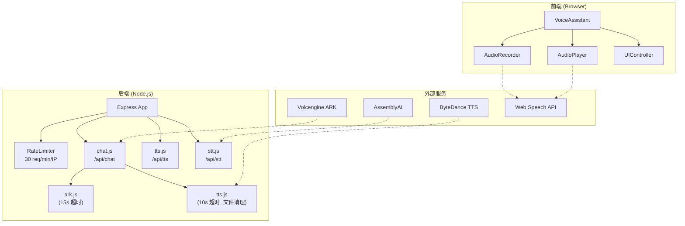
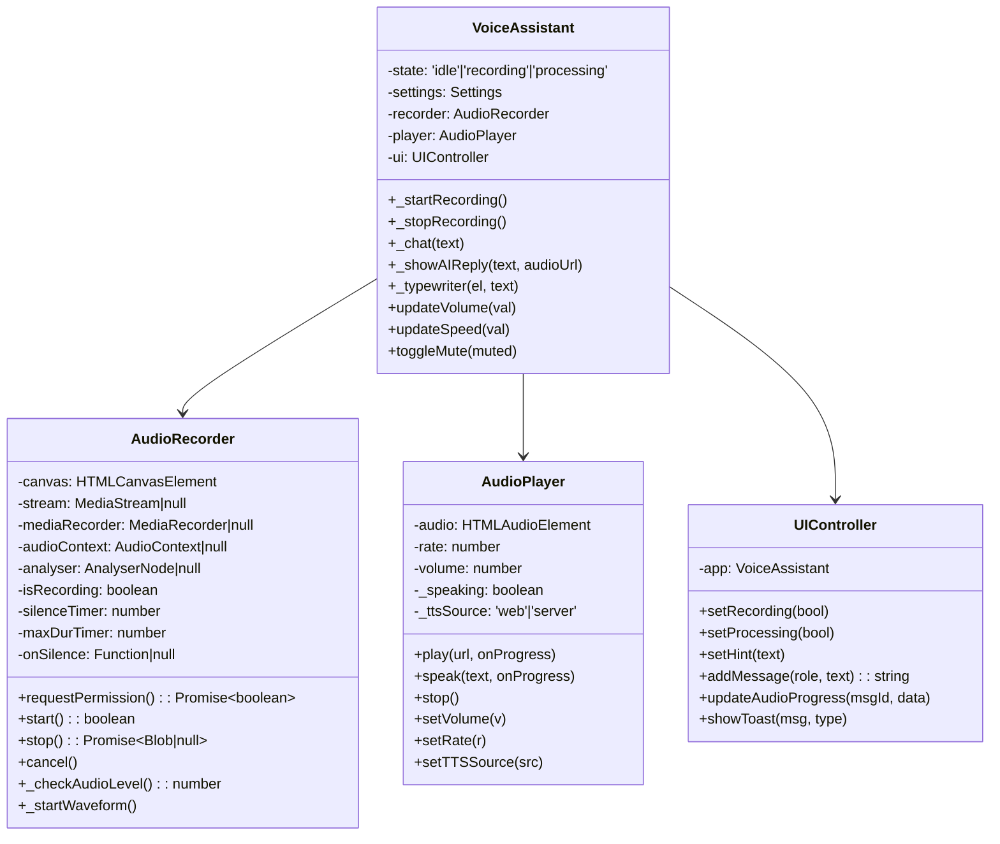
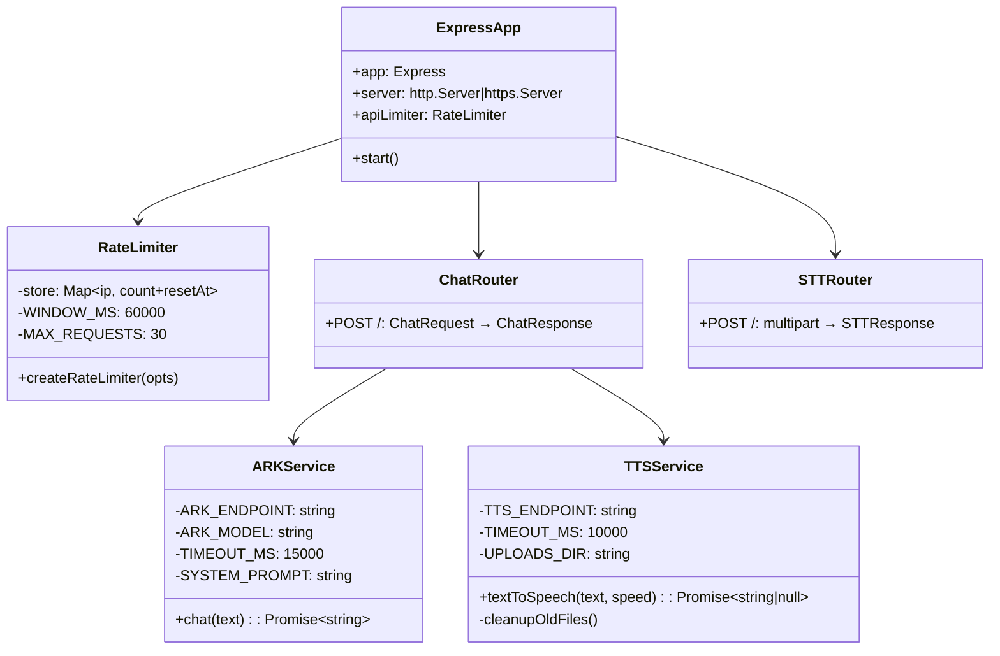
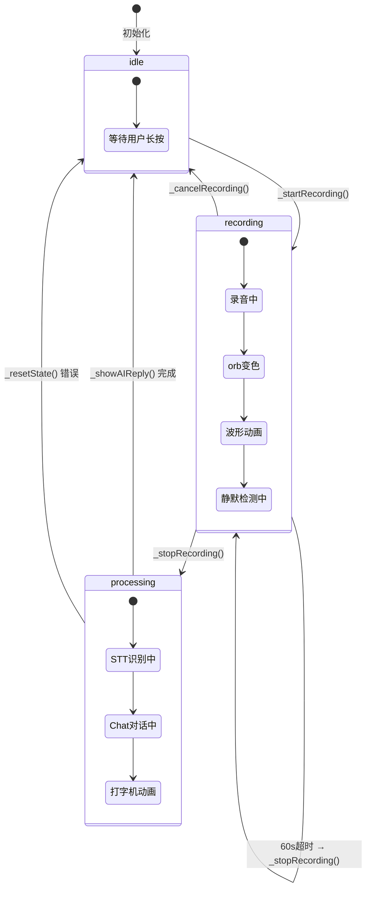
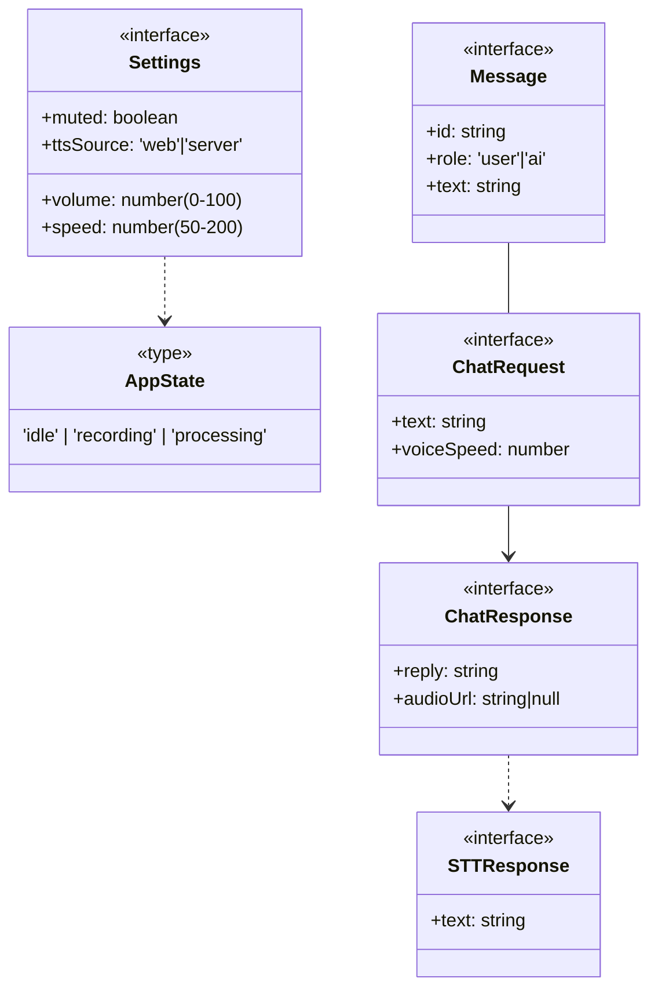
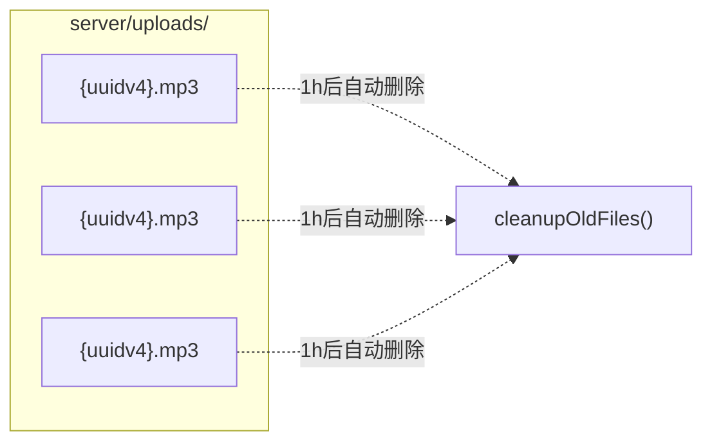
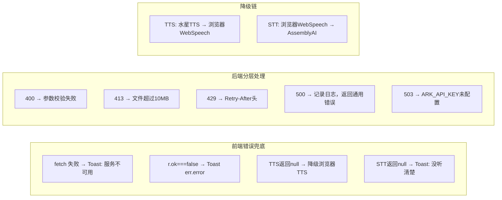

# 🎙️ H5 语音助手 — 概要设计（HLD）

> 版本：v1.1 | 日期：2026-05-14 | Mermaid 图表

---

## 一、系统模块划分



---

## 二、类图（Class Diagram）

### 2.1 前端类图



### 2.2 后端模块类图



---

## 三、组件状态机（State Diagram）

### 3.1 VoiceAssistant 主状态机



### 3.2 Orb 视觉状态

```mermaid
stateDiagram-v2
    [*] --> idle
    idle --> recording: mousedown / touchstart
    recording --> idle: mouseup / touchend / 60s超时
    recording --> processing: (松手)
    processing --> idle: 完成

    state idle {
        [*] --> orb紫色球体
        orb紫色球体 --> 呼吸光晕动画
    }

    state recording {
        [*] --> orb Accent色
        orb Accent色 --> ring扩散波纹
        ring扩散波纹 --> 波形动画
    }

    state processing {
        [*] --> orb旋转光环
        orb旋转光环 --> orb-icon-loading显示
    }
```

---

## 四、数据模型

### 4.1 前端状态



### 4.2 服务器端文件存储



---

## 五、路由矩阵

| 方法 | 路径 | 限流 | 说明 |
|------|------|------|------|
| GET | `/` | — | 302 → /index.html |
| GET | `/index.html` | — | 静态 HTML |
| GET | `/api/health` | — | 健康检查 |
| POST | `/api/chat` | 30/min | LLM 对话 |
| POST | `/api/tts` | 30/min | 语音合成 |
| POST | `/api/stt` | 30/min | 语音识别 |

---

## 六、错误处理策略


