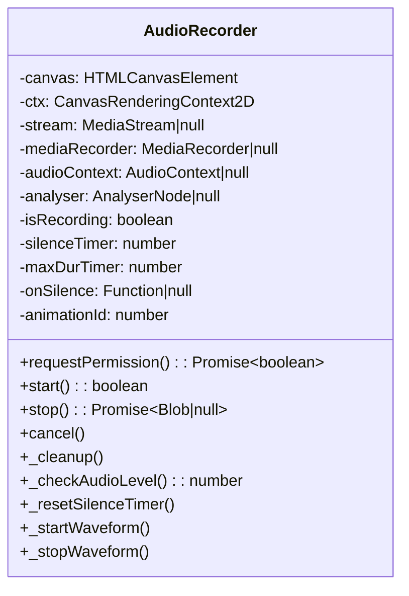
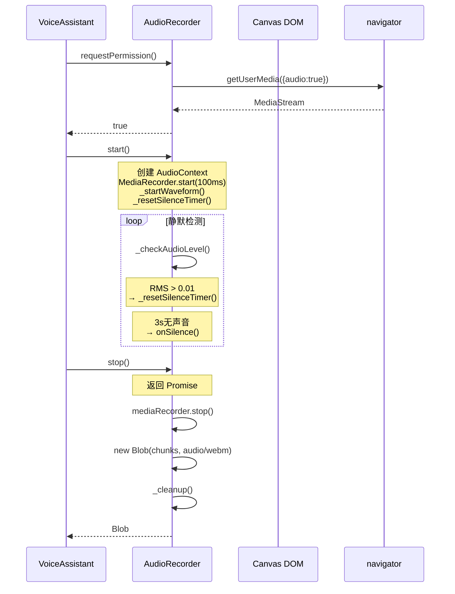
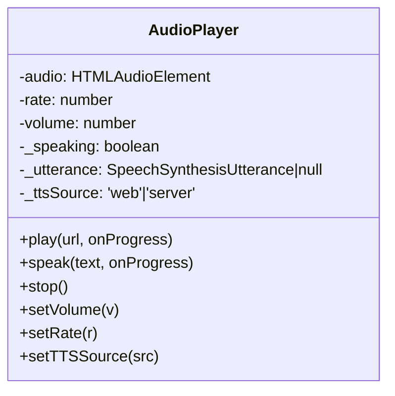
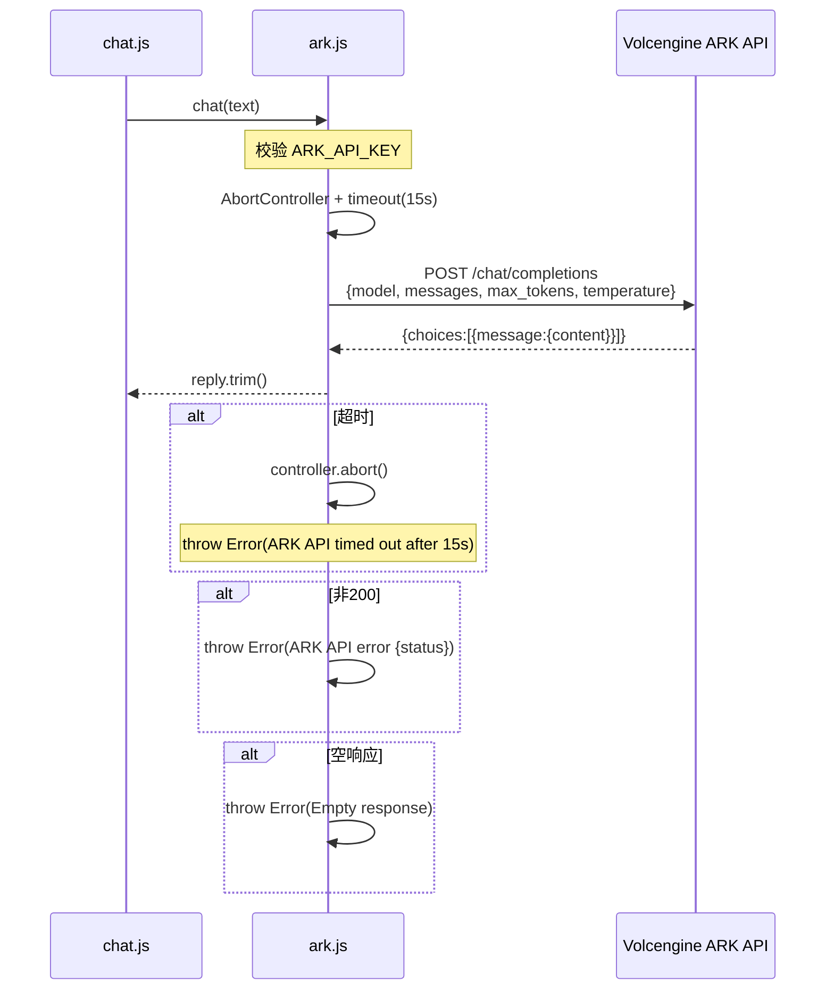
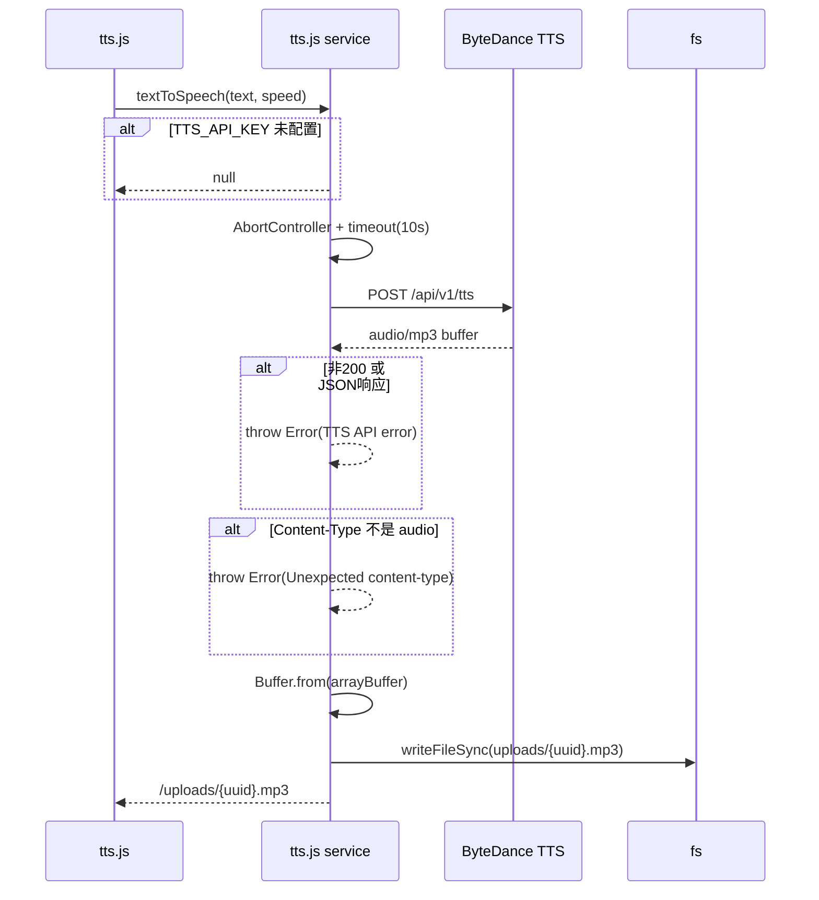
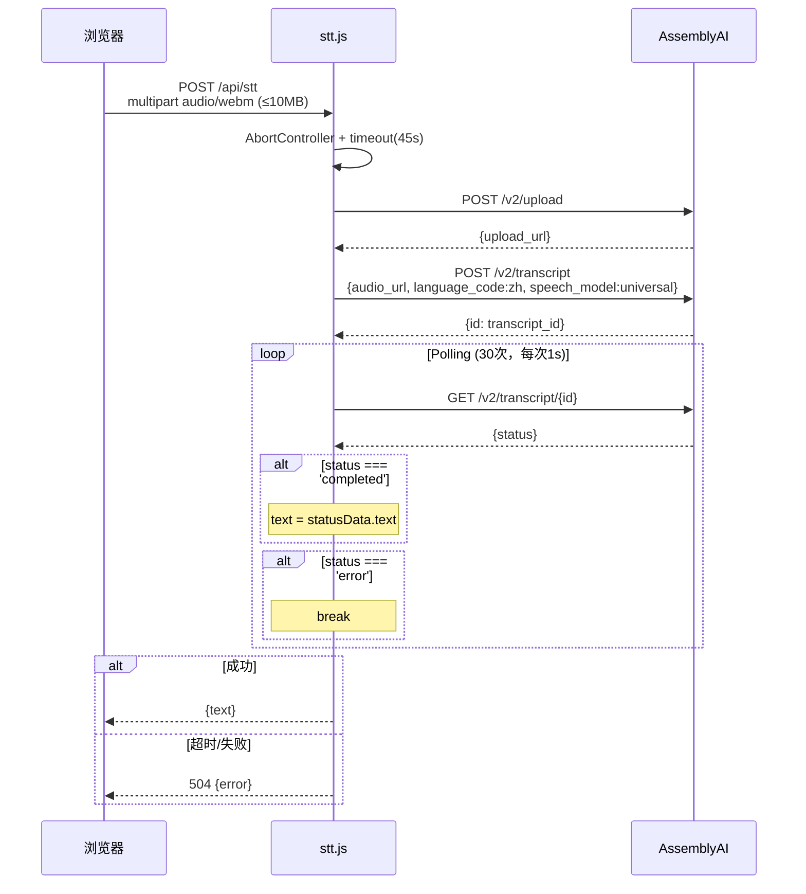
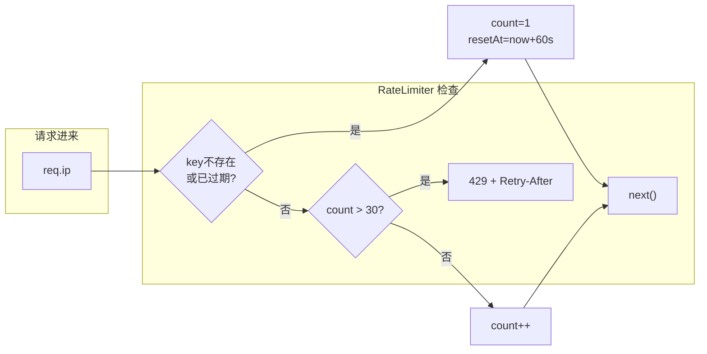
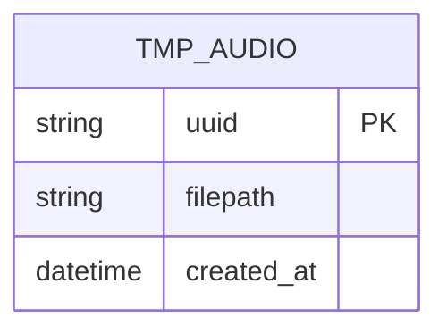
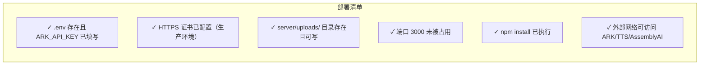

# 🎙️ H5 语音助手 — 详细设计（LLD）

> 版本：v1.1 | 日期：2026-05-14 | Mermaid 图表

---

## 一、AudioRecorder 详细设计

### 1.1 类结构

### 1.2 关键方法时序

---

## 二、AudioPlayer 详细设计

---

## 三、后端服务详细

### 3.1 ark.js — chat(text) 流程

### 3.2 tts.js — textToSpeech 流程

### 3.3 stt.js — POST /api/stt 流程

### 3.4 RateLimiter 流程

---

## 四、数据库表结构（无数据库，纯内存）

---

## 五、部署检查清单

