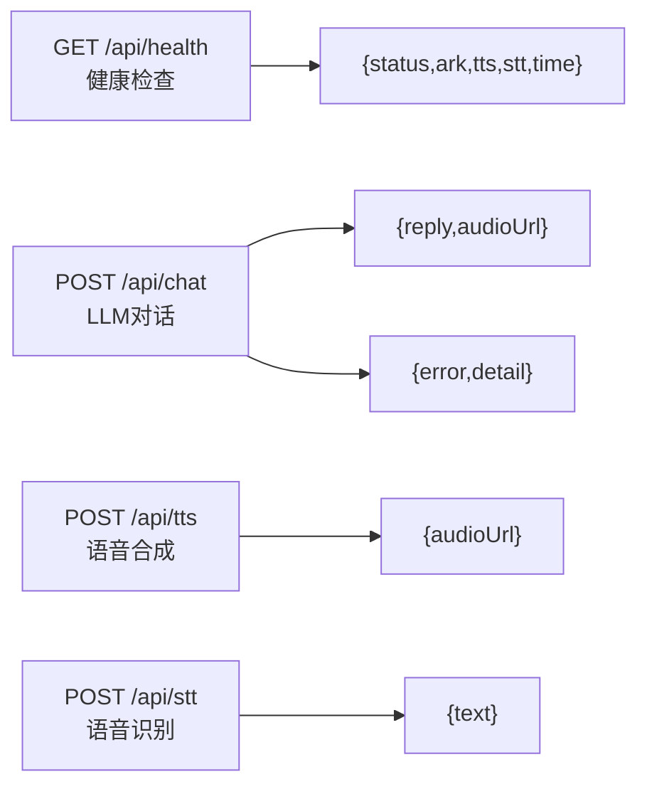
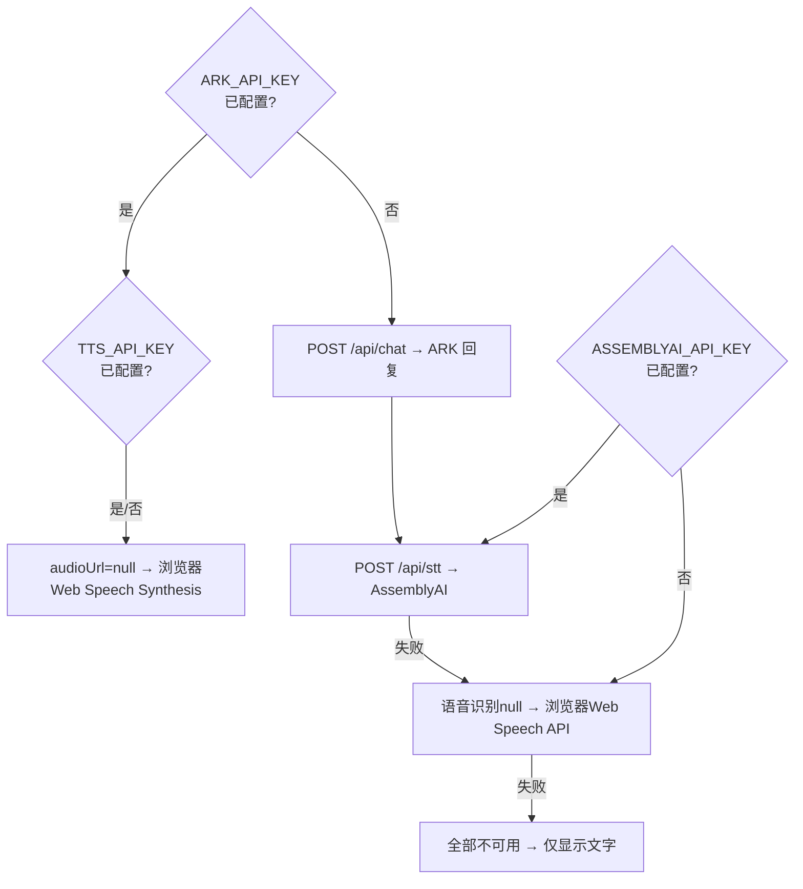
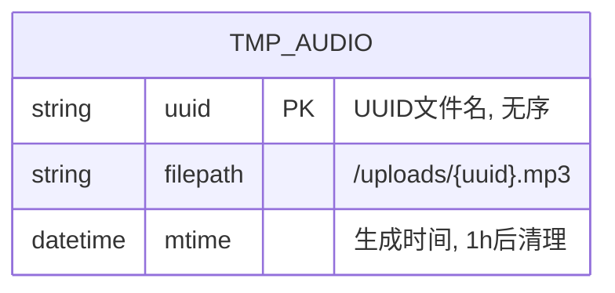

# 🎙️ H5 语音助手 — 接口设计（API Reference）

> 版本：v1.1 | 日期：2026-05-14 | Mermaid 图表

---

## 一、接口概览

## 二、通用规范

| 项目 | 值 |
|------|------|
| 窗口 | 60 秒 |
| 限制 | 同一 IP 每 60 秒最多 30 次请求 |
| 超限响应 | HTTP 429 + Retry-After 头 |
| 适用路径 | /api/chat, /api/tts, /api/stt |

## 三、接口详情

### GET /api/health

curl 示例：
curl https://api.example.com/api/health

响应：
{
  "status": "ok",
  "ark": true,
  "tts": false,
  "stt": false,
  "time": "2026-05-14T08:00:00.000Z"
}

字段说明：
- status: 固定 "ok"
- ark: ARK_API_KEY 是否已配置
- tts: TTS_API_KEY 是否已配置
- stt: ASSEMBLYAI_API_KEY 是否已配置
- time: 服务器当前时间（ISO 8601）

### POST /api/chat

curl 示例：
curl -X POST https://api.example.com/api/chat \
  -H "Content-Type: application/json" \
  -d '{"text":"你好","voiceSpeed":1.0}'

Request:
- text: string (必填, 1-2000字符)
- voiceSpeed: number (选填, 0.5-2.0, 默认1.0)

Response 200:
{
  "reply": "你好！我是你的语音助手...",
  "audioUrl": "/uploads/a1b2c3d4.mp3"
}

错误码:
- 400: text is required 或超过 2000 字符
- 429: 频率超限, 返回 retryAfter
- 500: ARK API 错误
- 503: ARK_API_KEY 未配置

### POST /api/tts

curl 示例：
curl -X POST https://api.example.com/api/tts \
  -H "Content-Type: application/json" \
  -d '{"text":"你好世界","voiceSpeed":1.0}'

Request:
- text: string (必填)
- voiceSpeed: number (选填, 默认1.0)

Response 200: {"audioUrl": "/uploads/xxx.mp3"}
Response 503: TTS_API_KEY 未配置, 前端降级到浏览器 TTS

### POST /api/stt

curl 示例：
curl -X POST https://api.example.com/api/stt -F "audio=@recording.webm"

Request: multipart/form-data, field=audio, audio/webm, max 10MB
Response 200: {"text": "用户说的话"}
错误码:
- 400: no audio file
- 413: 文件超过 10MB
- 429: 频率超限
- 502: 上传/转录失败
- 504: 转录超时

## 四、前端降级策略

## 五、音频文件规范

| 类型 | 格式 | 路径 | 生命周期 |
|------|------|------|---------|
| 上传STT | audio/webm | 内存中不存储 | 请求结束即释放 |
| 生成TTS | MP3 | /uploads/{uuid}.mp3 | 1小时内可访问 |
